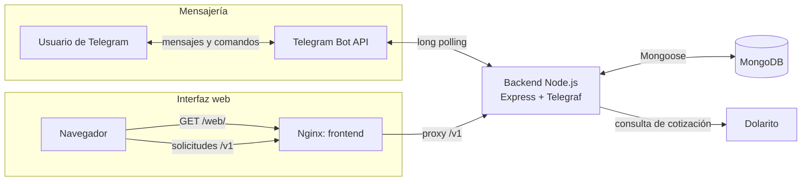

# Expense Bot Workspace

This folder is a local workspace for the Expense Bot application. It groups the
backend, frontend, and local backups so cross-app work can be done from one
place, while each app remains its own independent Git repository.

## Contents

- `backend-node-expenses/`: Telegram bot, Express API, MongoDB integration, and
  maintenance scripts.
- `web-react-expenses/`: React + Vite dashboard for viewing and editing
  expenses.
- `backups/`: local MongoDB backup exports. Treat these files as sensitive.
- `docker-compose.yml`: local stack for the backend, frontend, and MongoDB.
- `Makefile`: thin workspace orchestrator; it does not couple the child
  repositories.
- `AGENTS.md`: root instructions for agents working across projects.

## Common Commands

Each child repository retains its own portable commands. From the workspace
root, use `make` to coordinate them without creating a monorepo.

```sh
make install                 # npm ci in both projects
make build                   # build backend and frontend
make build-backend           # build only the backend
make build-frontend          # build only the frontend
make dev-backend             # run the backend development server
make dev-frontend            # run the Vite development server
make compose-build           # build all Compose images
make compose-build-backend   # rebuild only the app image
make compose-build-frontend  # rebuild only the web image
make up                      # start the current Compose images
make deploy                  # build and recreate the complete stack
make logs                    # follow all service logs
```

You can still run commands directly from the project they belong to:

Backend:

```sh
cd backend-node-expenses
npm run build
npm run dev
```

Frontend:

```sh
cd web-react-expenses
npm run build
npm run dev
```

## Local URLs

- Backend API: `http://localhost:3000`
- API namespace: `/v1`
- Frontend dev server: `http://localhost:5173`
- Frontend production path: `/web/`

## Arquitectura y comunicación



### Mensajería por Telegram

El backend consulta actualizaciones mediante *long polling*. Antes de procesar
cualquier mensaje valida que el usuario esté incluido en
`TELEGRAM_ALLOWED_USER_IDS`.

Comandos disponibles: `/start`, `/help`, `/expenses`, `/top`,
`/totalbyday`, `/totalbymonth`, `/totalbymonthtousd`, `/totalbyyear` y
`/getfeesbymonth`. Los mensajes de texto también se procesan como gastos.

### UI web

En Docker, Nginx publica la aplicación en `/web/` y reenvía las solicitudes
`/v1/` al backend. En desarrollo, Vite sirve la UI en el puerto `5173` y hace
el mismo proxy hacia `http://localhost:3000`.

### Endpoints HTTP expuestos

| Método | Ruta | Descripción |
| --- | --- | --- |
| `GET` | `/health` | Estado del proceso (`{ "status": "ok" }`). |
| `OPTIONS` | `/v1/*` | Respuesta CORS para la API. |
| `POST` | `/v1/expenses` | Crea un gasto desde la UI. |
| `PATCH` | `/v1/expenses/:expenseId` | Actualiza un gasto existente. |
| `GET` | `/v1/expenses/recent` | Lista gastos recientes; admite `chatId`, `search`, `startDate`, `endDate` y `limit`. |
| `GET` | `/v1/expenses/summary/month` | Totales por moneda y cantidad para el período filtrado. |
| `GET` | `/v1/expenses/analytics/categories` | Distribución de gastos por categoría. |
| `GET` | `/v1/dollar/cripto` | Cotización vendedora de dólar cripto, obtenida de Dolarito. |

`startDate` es inclusivo y `endDate` exclusivo. Si no se indican fechas, los
endpoints de consultas usan el mes actual. `limit` se limita a un máximo de
100.

> Nota: la UI contiene una llamada `DELETE /v1/expenses/:expenseId`, pero ese
> endpoint todavía no está expuesto por el backend. La tabla refleja las rutas
> realmente implementadas.

## Full local stack

Create a root `.env` from `.env.example`, fill in the Telegram settings, then run:

```sh
make deploy
```

`VITE_API_BASE_URL` is a build-time frontend setting. The example value is
correct for local browser access; set it to the public API URL before a remote
deployment and run `make deploy` again.

The backend backup command writes exports to this workspace's `backups/` directory by default.

## Notes

- The root folder is not intended to be a Git repository.
- Keep each child project self-contained.
- Keep secrets and backups out of documentation and source control.
- For cross-app work, start with `AGENTS.md`.
