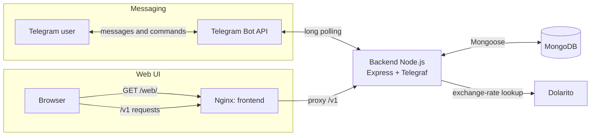

# Expense Bot Workspace

This folder is a local workspace for the Expense Bot application. It groups the
backend, frontend, and local backups so cross-app work can be done from one
place, while each app remains its own independent Git repository.

## Contents

- `backend-node-expenses/`: Telegram bot, Express API, MongoDB integration, and
  maintenance scripts.
- `web-react-expenses/`: React + Vite dashboard for viewing and editing
  expenses.
- `backups/`: local MongoDB backup exports. Treat these files as sensitive.
- `docker-compose.yml`: local stack for the backend, frontend, and MongoDB.
- `Makefile`: thin workspace orchestrator; it does not couple the child
  repositories.
- `AGENTS.md`: root instructions for agents working across projects.

## Common Commands

Each child repository retains its own portable commands. From the workspace
root, use `make` to coordinate them without creating a monorepo.

```sh
make install                 # npm ci in both projects
make build                   # build backend and frontend
make build-backend           # build only the backend
make build-frontend          # build only the frontend
make dev-backend             # run the backend development server
make dev-frontend            # run the Vite development server
make compose-build           # build all Compose images
make compose-build-backend   # rebuild only the app image
make compose-build-frontend  # rebuild only the web image
make up                      # start the current Compose images
make deploy                  # build and recreate the complete stack
make logs                    # follow all service logs
```

You can still run commands directly from the project they belong to:

Backend:

```sh
cd backend-node-expenses
npm run build
npm run dev
```

Frontend:

```sh
cd web-react-expenses
npm run build
npm run dev
```

## Local URLs

- Backend API: `http://localhost:3000`
- API namespace: `/v1`
- Frontend dev server: `http://localhost:5173`
- Frontend production path: `/web/`

## Architecture and communication



### Telegram messaging

The backend retrieves updates through *long polling*. Before processing a
message, it checks that the user is listed in `TELEGRAM_ALLOWED_USER_IDS`.

Available commands: `/start`, `/help`, `/expenses`, `/top`, `/totalbyday`,
`/totalbymonth`, `/totalbymonthtousd`, `/totalbyyear`, and
`/getfeesbymonth`. Plain text messages are also processed as expenses.

### Web UI

In Docker, Nginx serves the application at `/web/` and proxies `/v1/` requests
to the backend. During development, Vite serves the UI on port `5173` and
proxies the same requests to `http://localhost:3000`.

### Exposed HTTP endpoints

| Method | Route | Description |
| --- | --- | --- |
| `GET` | `/health` | Process status (`{ "status": "ok" }`). |
| `OPTIONS` | `/v1/*` | CORS preflight response for the API. |
| `POST` | `/v1/expenses` | Creates an expense from the UI. |
| `PATCH` | `/v1/expenses/:expenseId` | Updates an existing expense. |
| `GET` | `/v1/expenses/recent` | Lists recent expenses; accepts `chatId`, `search`, `startDate`, `endDate`, and `limit`. |
| `GET` | `/v1/expenses/summary/month` | Returns currency totals and expense count for the filtered period. |
| `GET` | `/v1/expenses/analytics/categories` | Returns expense distribution by category. |
| `GET` | `/v1/dollar/cripto` | Returns the crypto-dollar selling rate fetched from Dolarito. |

`startDate` is inclusive and `endDate` is exclusive. When dates are omitted,
query endpoints use the current month. `limit` is capped at 100.

> Note: the UI contains a `DELETE /v1/expenses/:expenseId` call, but the
> backend does not expose that endpoint yet. The table reflects the routes that
> are actually implemented.

## Full local stack

Create a root `.env` from `.env.example`, fill in the Telegram settings, then run:

```sh
make deploy
```

`VITE_API_BASE_URL` is a build-time frontend setting. The example value is
correct for local browser access; set it to the public API URL before a remote
deployment and run `make deploy` again.

The backend backup command writes exports to this workspace's `backups/` directory by default.

## Notes

- The root folder is not intended to be a Git repository.
- Keep each child project self-contained.
- Keep secrets and backups out of documentation and source control.
- For cross-app work, start with `AGENTS.md`.
